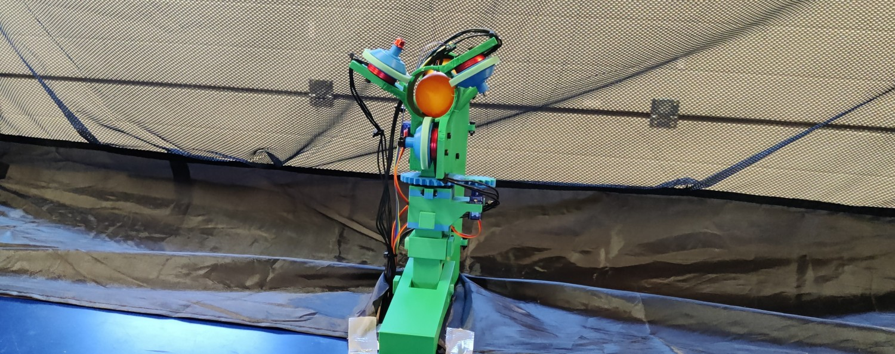

# Rhea: An open-source table tennis ball launcher robot for multiball training

<picture>

</picture>

## About

Rhea is an open-source table tennis ball launcher intended for multiball training.
Rhea is manufacturable with common hobbyist tools and comprises of readily available materials and components.

## Contents
  - [3D printing and assembly instructions](printing-and-assembly)
  - [Bill of Materials](bill-of-materials)
  - [3D models](models)
  - [Firmware](firmware)
  - [User software](software)
