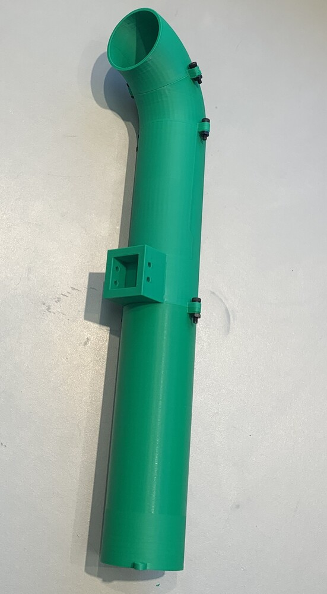
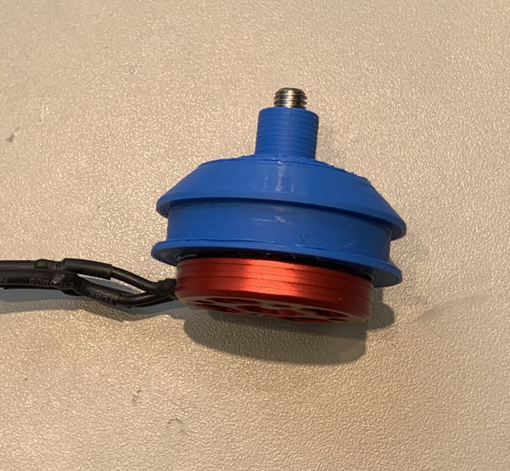
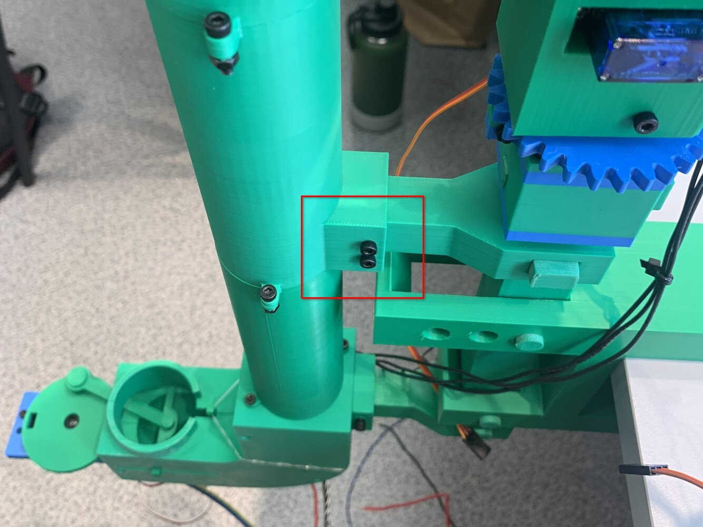

# Assembly instructions

## Ball Pusher

1. Solder four ribbon cable wires to the TCRT5000 sensor and glue it to the `Parallax servo holder`.

2. Mount the Parallax continuous servomotor to the `Parallax servo holder` using four M3x16 bolts with nuts. Two bolts are sufficient.

3. Pressure fit the cross-shaped connector provided with the Parallax continous servo into the `Crank`. Use glue if the fit is loose.

4. Secure the cross connector and the `Crank` to the servomotor using the screw provided with the servomotor.

5. Pressure fit the `Parallax servo holder` into `Housing 1`. Place the `Ball stopper` into `Housing 1` as indicated by the red square.

6. Slide the `Piston` sideways into `Housing 1`.

7. Attach `Housing 2` to `Housing 1`.

8. Twist the `Piston` counterclockwise so it is parallel to the sliding surface.

9. Attach the `Connecting rod` to the `Crank` and `Piston`.

10. Attach the `Crank retaining pin` to the `Crank` and the `Piston retaining pin` to the `Piston`.

11. Secure `Housing 1` and `Housing 2` together using four M3x20 bolts. Nuts are not required as the holes' inner diameter is smaller inside.

12. Attach a rubber band to hold the `Ball stopper` upright.

## Pipe

1. Secure `Angled connector pipe 1` and `Angled connector pipe 2` together using two M3x12 bolts and nuts on both sides.

2. Secure `Straight connector pipe top` and `Angled connector pipe 1` together using two M3x12 bolts and nuts on both sides.

3. Secure `Straight connector pipe top` and `Straight connector pipe bottom` together using two M3x12 bolts and nuts on both sides.

## Launch Unit

1. Make three traction wheels with `Traction wheel mould inner` and `Traction wheel mould outer` using polysiloxane. I recommend Shore 20-25 A hardness polysiloxane.

2. For each of the three BLDC motors: attach the `Motor guard`, stretch polysiloxane traction wheel around the `Motor guard`, and secure it using flange nut provided with the motor.

3. Pressure fit the arm-shaped connector that came with the TG90 servomotor into the `Servo hook`. Use glue if the fit is loose.

4. Mount the servomotor into the `Launch Unit` while connecting the servomotor to the arm-shaped connector. Secure it using two screws provided with the servomotor. **Note:** I recommend connecting the servomotor and `Servo hook` later if the position of the servomotor is unknown. 

5. Attach the three BLDC motors to the `Launch Unit` using six M3x8 bolts. Adjust the pinching distance as necessary. I recommend trying to minimise the pinching distance as much as possible with all three traction wheels still making contact with a table tennis ball.

6. Solder four ribbon cable wires to the TCRT5000 sensor and glue it to the `Launch Unit`.

## Pivot Mechanism

The assembly images show the Pivot Mechanism already connected to the Fixture but this is not required.

1. Place two `Bearing housing` on the `Housing` and lightly screw in four M3x12 bolts into the `Housing` but do not tighten them yet.

2. Secure the servomotor to the `Housing` using the provided screws and mount the provided cross-shaped connector to it.

3. Fit the 15x32x9 metal ball bearing between the two `Bearing housing`s and tighten them together using two M3x12 bolts and nuts. Tighten the four M3x12 bolts placed in step 1. Pressure fit the  `Shaft` into the ball bearing. Pressure fit the `Driver gear` into the arm-shaped cross of the servomotor. **Note:** I recommend pressure fitting the `Driven gear` into the `Shaft` later as the servomotor's initial position is unknown.

## Fixture

1.
    1. Slide and secure the first `Pusher and Pipe connector` into the `Rod` using the first `Rectangular dowel`.
    2. Slide and secure the Pivot Mechanism into the `Rod` using the `Square dowel`.
    3. Slide the `Rod` into the `Clamp` and secure it using two `Round dowel`s. 
    4. Slide and secure the first `Pusher and Pipe connector` into the `Rod` using the first `Rectangular dowel`.
    5. Turn the `Bolt` into the `Clamp`. The `Bolt pad` can be used between the `Bolt` and a table's underside when mounting.

2. Secure the Ball Pusher to the Fixture using four (one side depicted) M3x12 bolts.

3. Secure the Launch Unit to the Pivot Mechanism's `Shaft` using two M3x12 bolts. **Note:** Before securing the Launch Unit, find the zero position of the Pivot Mechanism's servomotor by powering the robot on. The firmware rotates the servomotor to its midway position (0 degree yaw angle) on startup. Afterwards, pressure fit the Pivot Mechanism's `Driven gear` into the `Shaft` and then secure the Launch Unit.

4. Secure the Pipe to the Fixture using four M3x12 bolts. Secure the Pipe to the Ball Pusher using two M3x8 bolts.

## Electronics

Hot glue the ESC's wires to prevent damage. I recommend also wrapping them using electrical tape.

Connect the components according to the following schematic:

Although not strictly required I recommend using a protoboard for wiring the 5 V & 3.3 V power lines and for wiring the four resistors required by both IR reflective sensors.

The `Enclosure` can be used to house all the electronic components:

The protoboard and ESP32 module are secured to the enclosure using 6 M3x8 bolts.

The different wirings can be tied together using cable ties and electrical tape to form a harness. Alternatively, sleeving or wire loom can be used.

