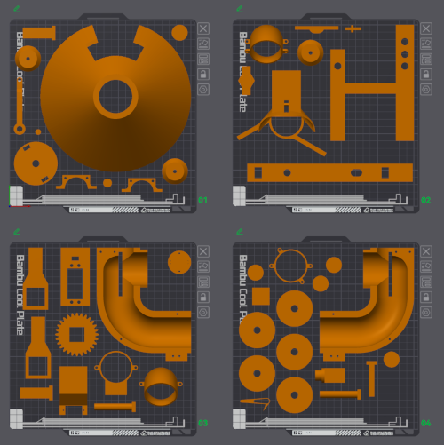

# Printing instructions

Models for printing are located in the subdirectories of `../models`. All models are orientated to their intended printing direction. All models are printed using PLA, a 0.4 mm nozzle, with 20% cubic infill and with 4 wall loops. Printing all the models (with supports) requires **1115 g** of filament.

`Rhea.step` contains the model of the whole assembly.

`Plates.3mf` contains organized build plates composed in BambuStudio:

## Ball Pusher

Some smaller components can optionally be printed underneath the Funnel.

Component | Quantity | Supports required?
---|---|---
`Ball stopper.stl` | 1 | No
`Connecting rod.stl` | 1 | No
`Crank retaining pin.stl` | 1 | No
`Crank.stl` | 1 | Yes
`Funnel.stl` | 1 | Yes (only for the cantilever)
`Housing 1.stl` | 1 | Yes
`Housing 2.stl` | 1 | Yes
`Parallax servo holder.stl` | 1 | No
`Piston retaining pin.stl` | 1 | No
`Piston.stl` | 1 | Yes

## Pipe

Component | Quantity | Supports required?
---|---|---
`Angled connector pipe 1.stl` | 1 | Yes
`Angled connector pipe 2.stl` | 1 | Yes
`Straight connector pipe bottom.stl` | 1 | Yes
`Straight connector pipe top.stl` | 1 | Yes

## Launch Unit

Component | Quantity | Supports required?
---|---|---
`Launch Unit.stl` | 1 | Yes
`Motor guard.stl` | 3 | Yes
`Servo hook.stl` | 1 | No

## Traction wheel mould

Printing one of each part is sufficient but would require mulitple polysiloxane mixing sessions. The parts are quite small hence I recommend printing 3 of each.

Component | Quantity | Supports required?
---|---|---
`Traction wheel mould inner.stl` | 3 | No
`Traction wheel mould outer.stl` | 3 | No

## Pivot Mechanism

Component | Quantity | Supports required?
---|---|---
`Bearing housing.stl` | 2 | No
`Driven gear.stl` | 1 | No
`Driver gear.stl` | 1 | No
`Housing.stl` | 1 | Yes
`Shaft.stl` | 1 | Yes

## Fixture

Component | Quantity | Supports required?
---|---|---
`Bolt pad.stl` | 1 | No
`Bolt.stl` | 1 | No
`Clamp.stl` | 1 | Yes
`Pusher and Pipe connector.stl` | 2 | Yes
`Rectangular dowel.stl` | 2 | Yes
`Rod.stl` | 1 | No
`Round dowel.stl` | 2 | Yes
`Square dowel.stl` | 1 | Yes

## Electronics enclosure

Component | Quantity | Supports required?
---|---|---
`Enclosure lid.stl` | 1 | No
`Enclosure.stl` | 1 | No

